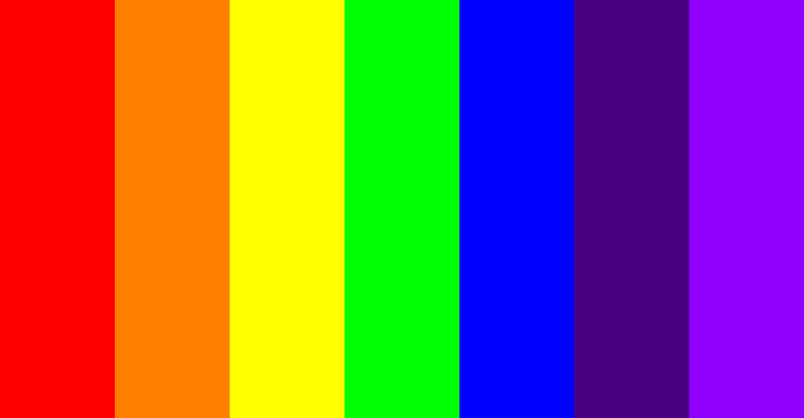

# __Sass and RWD - exam__

## Guidelines

1. [*Fork*](https://guides.github.com/activities/forking/) the repository containing exercises.
2. Clone the repository onto your computer using the command: `git clone repository_address`.
You will find the address of the repository by pressing "Clone or download" button on its webpage.
3. Complete the exercises and commit changes to your repository using the commands below.
`git add filename` will add a single file which you have changed.
If you want to add all the changed files at once, use `git add .`.
Remember that the fullstop (dot) at the end of this command is important!
Next, commit changes using `git commit -m "description_of_changes"`.
4. Push changes to your repository on GitHub by typing: `git push origin master`.
5. Create a [*pull request*](https://help.github.com/articles/creating-a-pull-request) to the original repository when you have finished all the exercises.

## Important

* Complete exercises in appropriate files in the ```partials``` catalog (e.g.: ```partials/_exercise01.scss```).
* We have prepared a ```main.scss``` file that imports all partials.
* Save the result of compiling __sass/main.scss__ in __css/main.css__ - do not change the arrangement of catalogs and files!
:boom: :boom: :boom:

### Remember that if you do not follow the instructions, the exercise will be __failed__! :bomb: :bomb: :bomb:
### If Sass files do not compile, the exam will be __failed__!
### If you cannot make something work properly - put this code fragment in a comment.

---------------------------------------------------------------------

## Exercise 1
(1 p)

Write a basic reset CSS in ```scss/partials/_exercise01.scss```

## Exercise 2
(2 pts)

Using Sass, define a map named ```rainbow``` that will hold  __7 key-value pairs__, where each value is another rainbow color. Use the colors below (important - make the names of colors and the values __exactly__ the same as given below):

    - Red: #FF0000
    - Orange: #FF7F00
    - Yellow: #FFFF00
    - Green: #00FF00
    - Blue: #0000FF
    - Indigo: #4B0082
    - Violet: #8F00FF


__Remember: The map should be named ```rainbow```__

## Exercise 3
(3 pts)

__Using Sass__, create all classes that you need to make your own grid. Let's assume that the grid will have 7 columns and that the main container is ```100%``` wide. Name classes related to the width of an element ```.col-X``` - e.g. ```.col-1```, ```.col-2``` ... ```.col-7```.
Do not forget about the ```container``` and ```row``` classes.

## Exercise 4
(2 pkt)

Set width and height for all sections:
- Elements with ```section-1``` or ```section-3``` class should have the height of __1000px__ and the entire available width,
- Element with ```section-2``` class should have __the entire width and height__ of the browser window.

## Exercise 5
(4 pts)

 In the section with ```section-1``` class, create a rainbow just like the one you see in the attached image. Set the width of the rainbow's container to 1000px. Every rainbow element should have the height of __1000px__ as well.

__Use:__
 - The map from __Exercise 2__ to color the rainbow. Use a loop to set colors for each column.
 - The class from __Exercise 3__ to position elements.




## Exercise 6
(4 pts)

Write a mixin and call it ```arrow```. The mixin should take __3__ parameters ```$color```, ```$direction```, and ```$size```.
The purpose of this mixin is creating an arrow of a given color, direction, and size.
Calling the mixin should look as follows:

```CSS
@include arrow(red, top, 15px);
```

or

```CSS
@include arrow(blue, bottom, 15px);
@include arrow(red, left, 15px);
@include arrow(red, right, 15px);
```

__Hints:__
* Do not use pseudoelements
* the name of the mixin has to be ```arrow```, do not change it!
* the order of the parameters should be exactly as shown in the call example above ($color, $direction, $size)

## Exercise 7
(4 pkt)

 The section with ```section-3``` class holds an image. Give it height of ```1000px``` (if it is not already done in __Exercise 4__). Then add conditions so that:
* If the screen width is greater than or equal to ```1025px```, the image width will be ```600px```, and it will be __in the center of the section__ (both vertically and horizontally),
* If the screen width ranges between ```768px``` and ```1024px``` (including endpoints), the image width will be ```200px```, and it will be located in __the top right corner of the section__,
* If the screen width is less than or equal to ```767px```, the image will have __the entire available width__ of the section.


Remember to always __maintain the right proportions__ of the image (it cannot be stretched vertically nor horizontally)!
Use flexbox only!

## __Good luck!__ :star: :smile: :+1:
